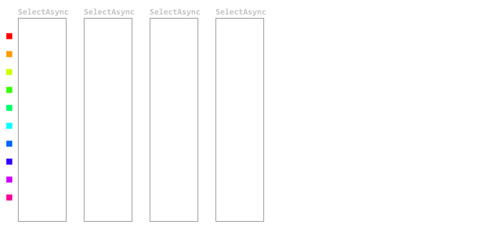

# AsyncPlinq: Async Parallel Linq

Small library to set up TPL based parallel pipelines using simple LINQ style queries.

Convert a LINQ query like this:

```csharp
var output = input.Select(i => Something(i)).Where(i => SomethingElse(i)).ToList();
```

into an async LINQ query that runs each stage with a certain degree of parallelism.

```csharp
var output = await input.SelectAsync(i => SomethingAsync(i)).WhereAsync(i => SomethingElseAsync(i)).ToListAsync();
```

The first query has the following run characteristics:


while the variant with `SelectAsync` and `WhereAsync` looks more like:


## Why this package?

Using async predicates or selectors in LINQ queries is always a bit difficult. Before .NET 10 there was no way of running async predicates or selectors _easily_. 

One would be tempted to convert the first query into something like this, but that will result in excessive parallelism. 

```csharp
var intermediate = await Task.WhenAll(input.Select(async i => SomethingAsync(i)));
// [..]
```


Using LINQ for `IAsyncEnumerable` makes it more easy, but does not run the selector and predicate in parallel:

```csharp
var output = await input.Select((i, index, ct) => SomethingAsync(i)).Where((i, index, ct) => SomethingElseAsync(i)).ToListAsync();
```


Converting it to a TPL Pipeline to get to the same characteristics introduces a lot of extra stuff:

```csharp
var selectBlock = new TransformBlock<int, int>(
    async x => SomethingAsync(x), 
    new() { MaxDegreeOfParallelism = 5 });
var whereBlock = new TransformManyBlock<int, int>(
    async x => SomethingElseAsync(x), 
    new() { MaxDegreeOfParallelism = 5 });

whereBlock.LinkTo(selectBlock, new() { PropagateCompletion = true });

foreach (var item in _data)
{
    await whereBlock.SendAsync(item);
}

whereBlock.Complete();

var data = await selectBlock.ReceiveAllAsync().ToArrayAsync();

return data;
```

## Per stage parallelism

With this library its possible to configure the following LINQ query, allowing you to configure the degree of parallelism per step in the query:

```csharp
var output = await input
    .SelectAsync(async i => SomethingAsync(i), 2)
    .WhereAsync(async i => SomethingReallySlowAsync(i), 5)
    .SelectAsync(async i => SomethingFastAsync(i), 1)
    .WhereAsync(async i => SomethingSlowAsync(i), 10)
    .ToArrayAsync();
```


Since this library processes all items eagerly, running an async parallel LINQ query with `FirstOrDefaultAsync()` will result in some wasted work:

```csharp
var output = await input
    .SelectAsync(async i => SomethingAsync(i), 2)
    .WhereAsync(async i => SomethingReallySlowAsync(i), 5)
    .SelectAsync(async i => SomethingFastAsync(i), 1)
    .WhereAsync(async i => SomethingSlowAsync(i), 10)
    .FirstOrDefaultAsync();
```


